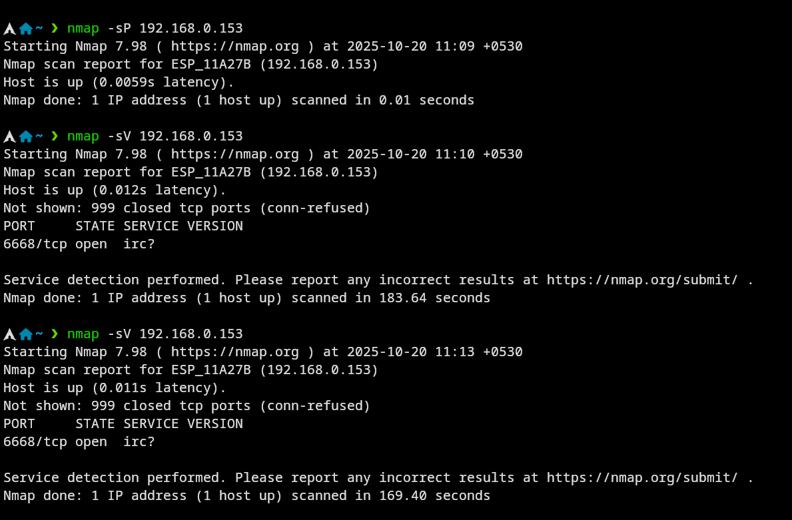
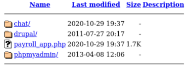

# Vulnerability Assessment Report

**Name:** Alvin Dennis  
**Date:** 2025-10-19  
**Target:** `VM Server` exploitation  

---

## 1. Purpose

The purpose of this assessment is to deploy the provided OVA in VirtualBox using a host-only network, analyze the system for security vulnerabilities, validate a critical vulnerability to demonstrate potential impact, and provide a comprehensive report with findings, risks, and remediation recommendations.

This assessment focuses on understanding the exposed services, enumerating potential attack surfaces, and documenting the risks associated with unpatched or misconfigured services. The report also outlines mitigation steps to reduce overall system risk.

---

## 2. Test Environment

- **Attacker VM:** Kali Linux (host-only) — `192.168.56.200`  
- **Target VM:** Imported OVA (Ubuntu 14.04 for this exercise) — `192.168.0.153`  
- **Tools used:**  
  - `nmap` — for host discovery, port scanning, and service enumeration  
  - Metasploit (`msfconsole`) — for exploiting identified vulnerabilities  
  - Web browser — for inspecting web applications and directory listings  
  - Standard Linux shell commands — for navigation, enumeration, and verification  

> **Note:** All actions were performed in a controlled, authorized environment. IPs are for demonstration purposes only.

---

## 3. Methodology

1. **Host Discovery:** Identified active hosts on the host-only network using `nmap -sP 192.168.56.200/24`.  
2. **Service Enumeration:** Scanned the target host to list open ports and services (`nmap -sV 192.168.0.153`).  
3. **Web Inspection:** Accessed the web server via browser at `http://192.168.56.0.153:6668` to identify available applications and check for directory listing.  
4. **Vulnerability Research:** Investigated FTP service `ProFTPD 1.3.5` and matched observed version to CVE-2015-3306 (mod_copy vulnerability).  
5. **Exploitation:** Leveraged Metasploit module `exploit/unix/ftp/proftpd_modcopy_exec` with a reverse shell payload to upload a web-accessible payload.  
6. **Payload Verification:** Successfully obtained a remote shell as `www-data` and verified access to web directories.  
7. **Web Application Enumeration:** Explored `/var/www/html` to confirm installed applications including Drupal, phpMyAdmin, payroll_app, and chat.

---

## 4. Findings

- **Critical Risk:** `ProFTPD 1.3.5` with `mod_copy` enabled allowed arbitrary file copy, which was exploited to gain remote code execution under the web server account.  
- **High Risk:** Multiple web applications were found in the document root (Drupal, phpMyAdmin, payroll_app), expanding the attack surface and increasing potential exposure.  
- **High Risk:** MySQL service was network-accessible and could be abused if weak or default credentials were used.  
- **Medium Risk:** Directory listing was enabled, revealing application structure and files that could assist an attacker.  
- **Other Observations:** Default configurations, lack of access restrictions, and outdated software increased overall system risk.  
- **Impact Summary:** The combination of FTP vulnerability, exposed web applications, and accessible database services allows for full compromise at the web server level.

---

## 5. Detailed Action Log

1. **Host Discovery:**  
   - Executed `nmap -sP 192.168.56.200/24`  
   - Discovered target host at `192.168.0.153`  

1. **Port & Service Scanning:**  
   - Executed `nmap -sV 192.168.0.153`
   - Service banners collected for version analysis  

2. **Web Server Assessment:**  
   - Accessed `http://192.168.0.153:6668`  
   - Identified directory listing enabled  
   - Located applications: Drupal, phpMyAdmin, payroll_app, chat  

1. **FTP Vulnerability Analysis:**  
   - Version: `ProFTPD 1.3.5`  
   - Identified vulnerability: CVE-2015-3306 (mod_copy allows arbitrary file operations)  

2. **Exploitation Steps:**  
   - Metasploit: `exploit/unix/ftp/proftpd_modcopy_exec`  
   - Payload: Reverse shell to attacker IP `192.168.56.200`  
   - Verified shell access as `www-data`  

3. **Web Directory Enumeration:**  
   - Explored `/var/www/html`  
   - Confirmed presence of multiple applications  
   - Checked file permissions and structure  

4. **Database Assessment:**  
   - MySQL port is reachable  
   - Weak credentials could allow unauthorized access  

---

## 6. Potential Impact

- Attackers with web server access can execute arbitrary commands as `www-data`.  
- Ability to upload or modify web content.  
- Possible access to backend databases if weak credentials are present.  
- High potential for sensitive data compromise, website defacement, or lateral movement within the network.  

---

## 7. Recommendations

1. **Patch Vulnerable Service:** Upgrade or remove ProFTPD 1.3.5 or disable the `mod_copy` module immediately.  
2. **Restrict FTP Access:** Remove write permissions to web directories and restrict FTP service to trusted users.  
3. **Secure Web Applications:** Disable directory listing, enforce authentication, and restrict access to admin panels (Drupal, phpMyAdmin).  
4. **Database Security:** Limit MySQL access to localhost or trusted hosts, enforce strong credentials, and rotate passwords regularly.  
5. **Post-Exploitation Clean-Up:** Scan for backdoors, remove uploaded payloads, and review file integrity.  
6. **Long-Term Controls:** Implement patch management, regular vulnerability scanning, and access control policies.

---

## 8. Conclusion

The imported virtual appliance contained a known FTP vulnerability allowing file upload and remote shell access. Exposed web applications and network-accessible MySQL further increased risk, resulting in a high-impact compromise scenario. Applying prioritized remediation steps reduces exposure, mitigates the immediate threat, and strengthens overall system security posture.