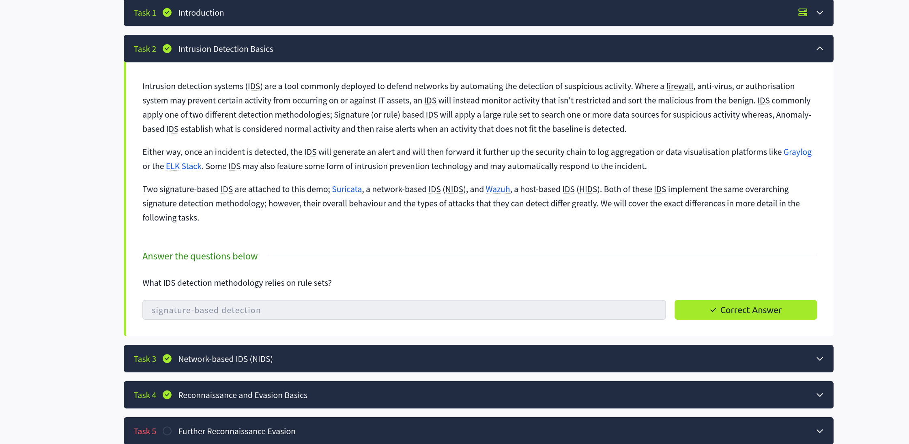
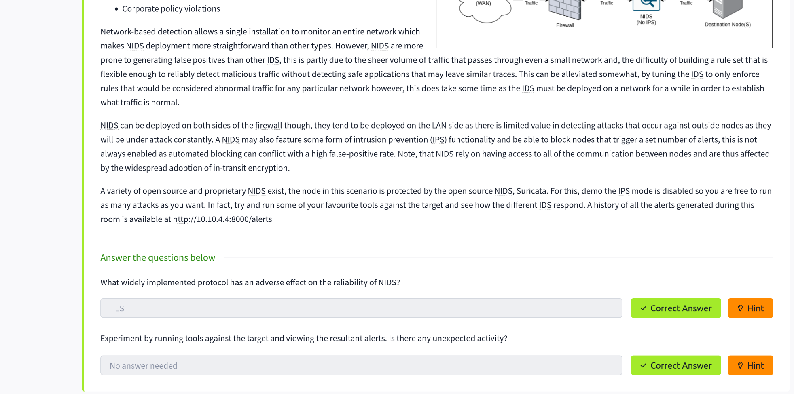
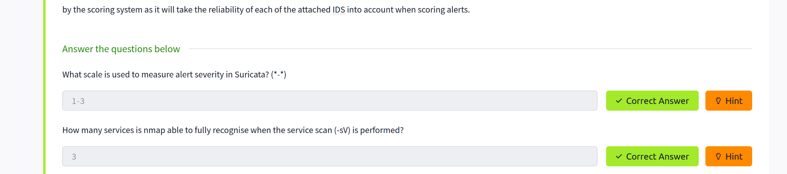
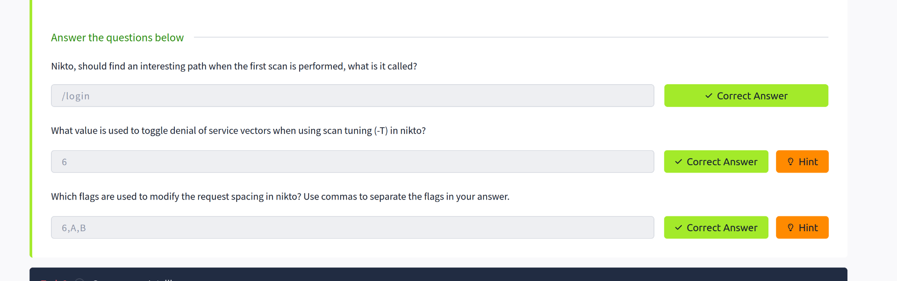
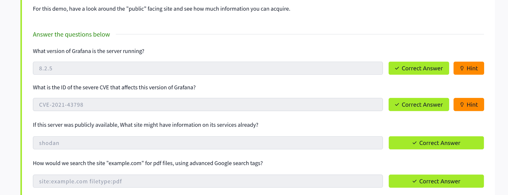
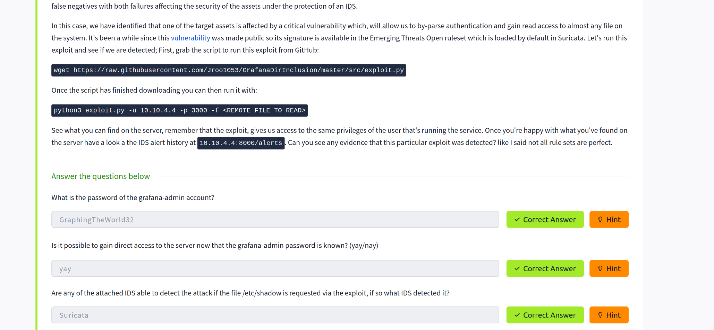
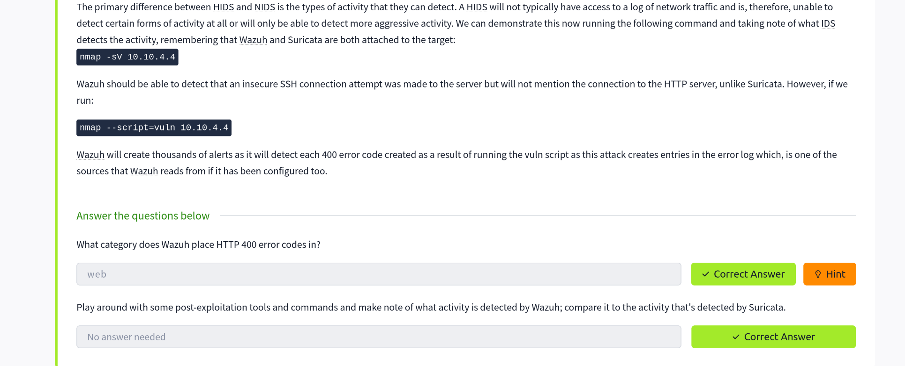
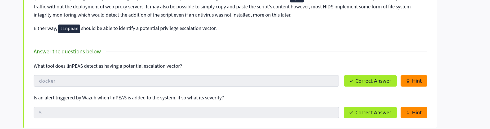
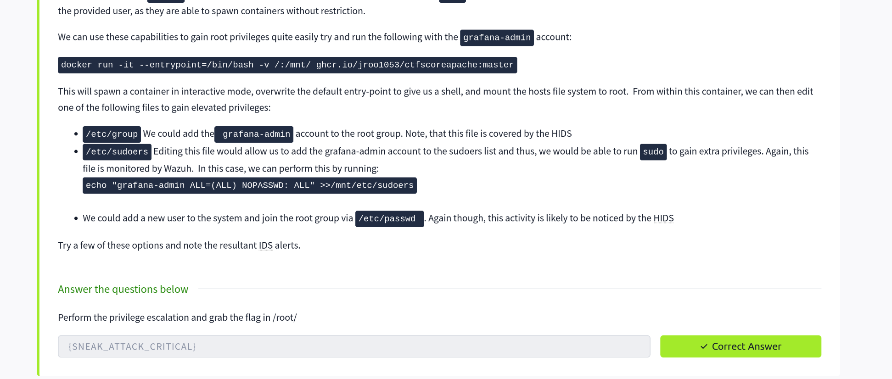

# Task 8: Intrusion Detection and Evasion

## Overview

This writeup documents the steps and findings while completing **Task 8** from the TryHackMe **IDS Evasion** room. The room explores how Network Intrusion Detection Systems (NIDS) such as **Suricata** and host-based detection tools like **Wazuh** detect scanning and evasion techniques, and demonstrates vulnerability discovery and privilege escalation on a target system.

---

## Setup

- Start the target virtual machine (VM).  
- Connect to the TryHackMe network using **Attackbox**.  
- Record your machine IP and the target IP for scanning and analysis.

---

## Task 2 — Protocols and Alerts

- From the reading and research, the widely observed protocol in NIDS alerts for this lab is **TLS**.
- Scanning the target triggers multiple alerts in the IDS dashboard. This confirms the IDS is active and monitoring traffic.





---

## Task 4 — Suricata Alerts & Severity

- Observed the IDS alert display while performing active scans.
- Alert counts and scores increase as the scan continues.
- **Suricata severity scale** observed: **`1–3`** (low → high).
- **Services detected by Nmap with `-sV`:** **`3`**.



---

## Task 5 — Web Scanning with Nikto

- Running **Nikto** against the web server revealed an interesting path: **`/login`** on **port 3000**.
- Inspecting Nikto’s help output and scan-tuning options revealed:
  - Denial of Service toggle (`-T`) value used to denote DoS vectors: **`6`**.
  - Request spacing / evasion flags: **`6, A, B`**.

### Screenshot: Nikto output and options



---

## Task 6 — Grafana Discovery & CVE Research

- Port **3000** served a **Grafana** login page.
- Grafana version information was visible on the UI
- Next steps included searching public vulnerability databases for Grafana CVEs (Common Vulnerabilities and Exposures) for known exploits tied to the observed version.



---

## Task 7 — Google Dorking Example

- **Dorking** helps find specific file types and pages:
  - Example syntax: `site:targetdomain filetype:pdf`
- Useful for locating sensitive files or configuration dumps indexed by search engines.




---

## Task 8 — Wazuh Alerts

- Executing the prescribed commands shows alerts detected by **Wazuh**.
- The alerts relevant to the web activity were categorized under **`web`**.





---

## Task 9 — Privilege Escalation

- After initial access to Grafana (user-level), the task required escalating to **root**.
- Investigated available groups and accessible commands on the system.
- Used a Docker to obtain elevated privileges:

```bash
docker run -it --entrypoint=/bin/bash -v /:/mnt/ ghcr.io/jroo1053/ctfscoreapache:master
```

- After executing the container command and navigating the filesystem, a `root.txt` file was discovered containing the hidden flag.



---

## Conclusion

- The lab completed the IDS Evasion exercise end-to-end.
- Key takeaways:
  - IDS (Suricata) and host-monitoring (Wazuh) effectively detect scanning and common web attack patterns.
  - Nikto and Nmap are useful for discovering service info and web paths that generate IDS alerts.
  - Known vulnerabilities (via CVEs) and container misconfigurations can be leveraged for privilege escalation.
- This task reinforced practical skills in scanning, alert analysis, vulnerability discovery, and privilege escalation techniques.

---
