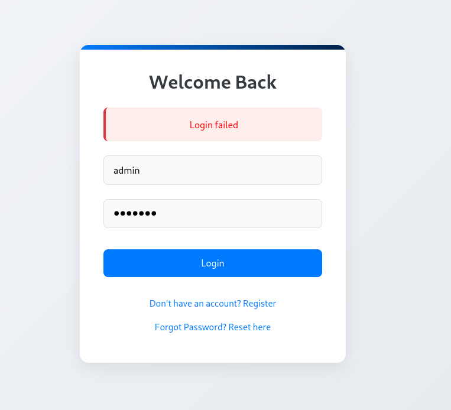

## VULN-BANK — SECURITY REPORT

### Vulnerability Assessment & Exploitation Findings

| Detail | Value |
| :--- | :--- |
| **Environment** | Local Docker (`http://localhost:5000`) |
| **Repository** | `github.com/Commando-X/vuln-bank` |
| **Prepared by** | DILSHAD AHAMMED |
| **Date** | 10 October 2025 |

-----

### Executive Summary

I deployed the `vuln-bank` application locally and performed targeted testing of authentication, password reset, payment/checkout, and account balance flows.

A **high-impact weakness** was confirmed in the **password-reset PIN flow** (3-digit brute-force $\rightarrow$ admin takeover). Additional confirmed issues include improper input handling on login (**SQLi patterns observed**), **balance/amount tampering**, **checkout/price tampering**, and weak validation in **virtual card/token generation**.

These vulnerabilities allow account takeover, financial manipulation, and token misuse. **Immediate remediation** of the password reset flow and comprehensive server-side validation for all financial operations is strongly recommended.

-----

### Scope of Assessment

The assessment covered the locally deployed `vuln-bank` application at `http://localhost:5000`. Tests focused on inputs and flows that directly affect authentication and financial integrity, including:

  * Login/Authentication
  * Directory Enumeration
  * Password Reset
  * Account Balance/Transfer
  * Checkout/Cart
  * Virtual Card/Token Generation

-----

### Methodology

1.  **Deployment**: The application was deployed locally using Docker (`git clone` $\rightarrow$ `docker-compose up --build -d`).
2.  **Mapping**: Functionality was mapped via the web UI and browser developer tools.
3.  **Testing**: Targeted tests were performed using a browser, **Burp Suite** (Proxy & Intruder), and manual request tampering.
4.  **Reporting**: Evidence (requests/responses, UI behavior, screenshots) was collected, and remediation advice was produced.

-----

### Vulnerability Findings

#### 1\. Authentication / Input Handling — SQL Injection Indicators

| Detail | Description |
| :--- | :--- |
| **Risk Level** | MEDIUM |
| **Finding** | The login form returned distinct responses when supplied SQL-style payloads (`'|| 1=1;-- -`), indicating insufficient input sanitization and a potential SQL Injection risk. |
| **Impact** | If backend queries are not parameterized, this could lead to authentication bypass or data extraction. |
| **Test** | Manual submission of SQLi-style payload to the login form; observed response behavior. |
| **Recommendation** | Use **parameterized queries/prepared statements** and validate inputs server-side. |
| **Evidence** |  |

#### 2\. Password Reset — 3-digit PIN Brute-Force (Confirmed)

| Detail | Description |
| :--- | :--- |
| **Risk Level** | **HIGH** |
| **Finding** | The password reset flow relies on a **3-digit PIN (000–999)** with **no brute-force protections** (no rate limiting, no lockout, no CAPTCHA). This allowed automated brute forcing of the PIN. |
| **Impact** | **Full administrative account takeover**; attacker control of application configuration, accounts, and data. |
| **Test** | Discovered password reset flow used Burp Intruder (000 $\rightarrow$ 999, padding 3) to find the valid PIN; reset admin password to `newAdmin` and logged in. |
| **Recommendation** | Replace short PINs with **cryptographically secure, single-use tokens** delivered to verified channels (email), implement **rate limiting/lockout**, add **CAPTCHA/MFA** for high-privilege flows, and log/alert on attempts. |
| **Evidence** |   |

#### 3\. Balance Manipulation / Improper Input Validation (Confirmed)

| Detail | Description |
| :--- | :--- |
| **Risk Level** | **HIGH** |
| **Finding** | The server accepted **client-supplied numeric values** for transfers and balances without strict server-side validation. Tampering with `amount` fields via request interception was reflected in the UI. |
| **Impact** | **Financial fraud** — balance inflation, unauthorized transfers, or theft. |
| **Test** | Intercepted transfer POSTs with Burp, modified `amount`/`balance` fields, and observed resulting account balance behavior. |
| **Recommendation** | **Enforce server-side numeric validation** and DB constraints. Balances and transfers must be calculated server-side. Add logging/alerts for anomalous transactions. |

#### 4\. Checkout / Price Tampering (Confirmed)

| Detail | Description |
| :--- | :--- |
| **Risk Level** | **HIGH** |
| **Finding** | The checkout process accepted client-supplied price/total values. Modifying the cart/requested price led to accepted payments at tampered amounts. |
| **Impact** | **Payment fraud**, underpayment, and reconciliation issues. |
| **Test** | Modified `price`/`total`/`invoice_id` in intercepted checkout requests; observed accepted transactions reflected in UI. |
| **Recommendation** | **Compute prices and totals server-side** from product IDs. Validate invoice IDs and payment tokens server-side. |

#### 5\. Virtual Card / Token Generation — Weak Validation (Confirmed)

| Detail | Description |
| :--- | :--- |
| **Risk Level** | MEDIUM-HIGH |
| **Finding** | The virtual card/token generation endpoint accepted weakly validated inputs and issued tokens without strong server-side controls. |
| **Impact** | Token misuse, fraud, or bypass of payment controls. |
| **Test** | Exercised the virtual card flow and submitted crafted/edge inputs; tokens were generated and accepted. |
| **Recommendation** | Restrict token/card creation to **authorized flows**. Generate tokens **server-side** using secure providers, validate inputs, and **rate-limit issuance**. |

-----

### Risk Assessment (Verified Items)

| Finding | Risk Level | Notes |
| :--- | :--- | :--- |
| Password reset brute-force | **HIGH** | Confirmed exploit and admin takeover. |
| Balance manipulation | **HIGH** | Confirmed via request tampering. |
| Checkout price tampering | **HIGH** | Confirmed via request tampering. |
| Virtual card generation | MEDIUM-HIGH | Confirmed weak validation. |
| SQLi indicators on login | MEDIUM | Observed input handling issues; backend remediation required. |

-----

### Recommendations (Prioritized)

#### High Priority:

  * **Disable or secure the PIN reset flow**; issue random, single-use reset tokens via verified email with short TTL.
  * **Enforce server-side validation** for all financial inputs (`amount`, `balance`); add DB constraints and transaction checks.
  * **Recompute prices/totals server-side**; never trust client-sent price fields.
  * **Rate-limit** login/reset endpoints; implement lockouts and CAPTCHA for sensitive flows.

#### Medium Priority:

  * **Parameterize all DB queries** and sanitize inputs to mitigate SQLi risk.
  * Harden virtual card/token generation: enforce **server-side generation** + authorization + rate limits.
  * Add **logging and alerts** for anomalous transfers and repeated reset attempts.

#### Longer Term:

  * Enforce **HTTPS**, secure cookies, Content Security Policy (CSP).
  * Integrate automated security checks in CI/CD pipelines.
  * Schedule periodic penetration tests and security code reviews.
